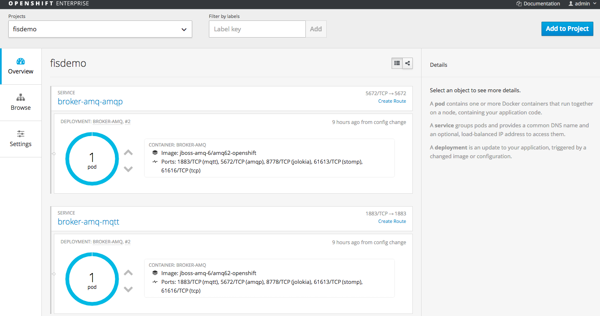
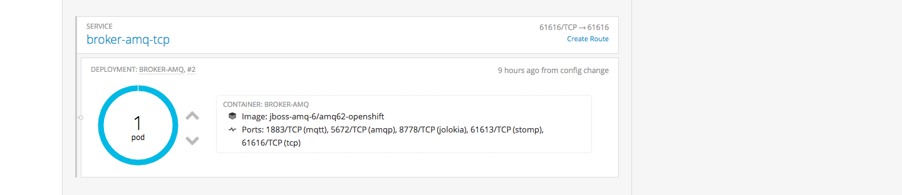
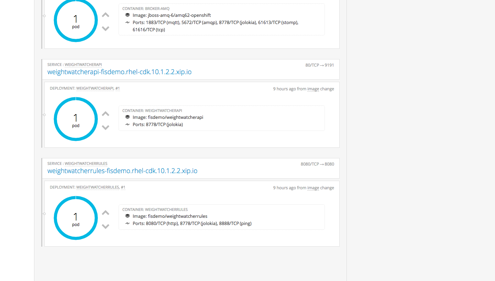
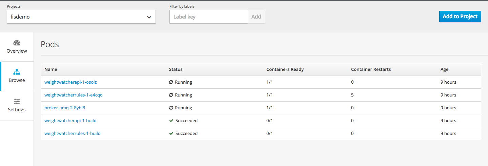
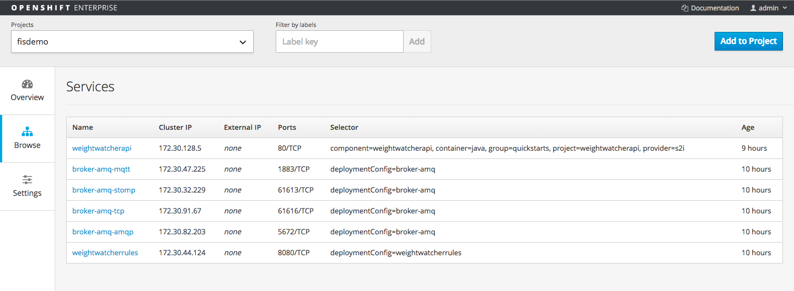
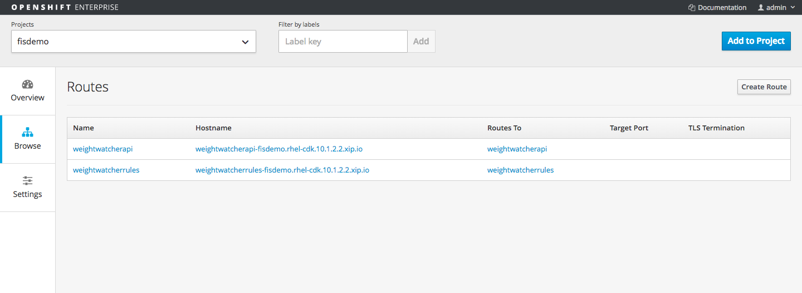
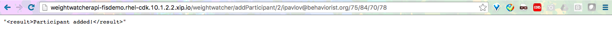
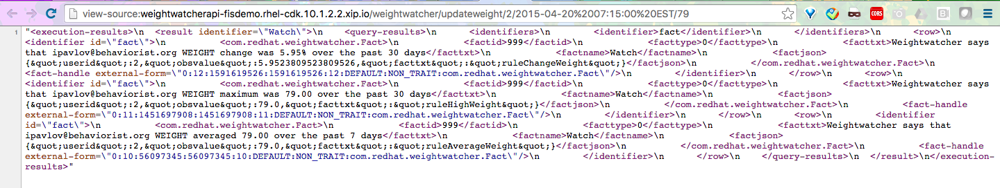
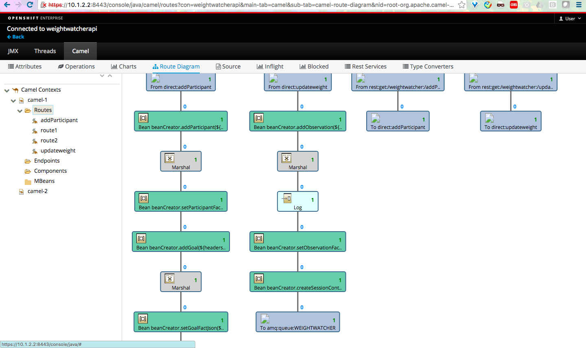

FIS Weightloss DEMO
======================================

Cloud computing must handle a multitude of business events from many different devices. It must process, analyze, and react to the ever-changing business world. Red Hat JBoss A-MQ provides many common protocols to connect business events to devices, but business information without the ability to filter for effective customer responses, to detect meaningful behavior, and to react in a timely manner will cripple our customer relationships. Red Hat JBoss BRMS and Red Hat JBoss Fuse go beyond connecting and collecting events and use business rules to determine which events require action to enhance the customer experience. Join this hands-on session to: - Create asynchronous, event-driven integration between services using JBoss A-MQ - Create rules to to analyze business events with JBoss BRMS - Integrate rules, messages, and events with enterprise integration patterns (EIP) using JBoss Fuse - Deploy a multi-container microservices application on OpenShift by Red Hat
The background of the scenario is a weight watcher program, which allows users to register with their weight loss target. Once registered, it will base on daily input from devices sent in to the system to provide calculated statistic of how this person is doing. 

This example expose two RESTFul Endpoints
- one takes in participants data
- one receives constant updates of weight and returns the analyzed result back. 

There are four Camel route that takes care of things
- Create an event base system by exposing RESTFul Endpoint using REST DSL with Camel 
- Transform the entered data into JSON format required by BRMS, and then wrap these data in XML which is needed by decision server. 
- Connecting to BRMS decision server with API Call 
- Filter and parse the return result 


Installation
----------------------------------
Make sure you have installed Vagrant and Virtual box. run initCDK.sh to setup CDK and web services (SKIP this section if you have already installed)

		```
    $ ./initCDK.sh
    ```

Install the project on OpenShift by running init.sh
                                                                      
    ```
    $ ./init.sh
		```
		
Login to OpenShift console with USERNAME/PWD admin/admin             

		```
    https://10.1.2.2:8443/console/                                    
		```




Also Pods, services and route




 
Running the demo
----------------------------------

Registering a new Participants:
Before we start sending in weight, we need to register the participants and set their goal. 

```
http://weightwatcherapi-fisdemo.rhel-cdk.10.1.2.2.xip.io/weightwatcher/addParticipant/2/ipavlov@behaviorist.org/75/84/70/78
```


Events - Updating weight:
In a browser or any REST client app, trigger the event by updating the weight as we measure every-time. Each event will then pass into rule engine through our API. You should be able to see the calculated response from weight watcher. 

```
http://weightwatcherapi-fisdemo.rhel-cdk.10.1.2.2.xip.io/weightwatcher/updateweight/2/2015-04-20%2007:15:00%20EST/79

http://weightwatcherapi-fisdemo.rhel-cdk.10.1.2.2.xip.io/weightwatcher/updateweight/2/2015-04-25%2007:15:00%20EST/77

http://weightwatcherapi-fisdemo.rhel-cdk.10.1.2.2.xip.io/weightwatcher/updateweight/2/2015-04-28%2007:15:00%20EST/76
```



##Scaling up the application
As the weight watcher became more popular, more clients wants to join the program, we need to  scale up our application to meet the demands, the very nature of Camel and OpenShift allows you do this with a few click of a button. 

In the overview page, you should be able to see the exposed service, click on the upper arrow button to add one more pod running on OpenShift. 